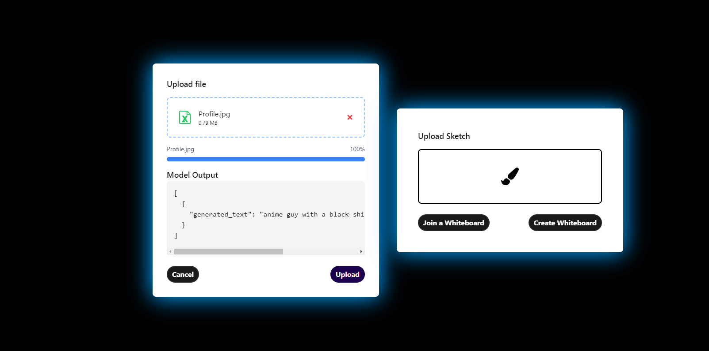

# Project Setup Guide

This guide will help you set up the project locally, including running Keycloak in a Docker container, installing necessary packages, and running both the frontend and backend applications.

## Prerequisites

Before you begin, ensure you have the following installed on your machine:

- [Node.js](https://nodejs.org/) (version 14 or higher)
- [Docker](https://www.docker.com/get-started)
- [Docker Compose](https://docs.docker.com/compose/install/)

## Step 1: Set Up Keycloak with Docker

1. **Pull the Keycloak Docker Image**:
   Open your terminal and run the following command to pull the Keycloak image:
   ```bash
   docker pull jboss/keycloak
   ```
2. **Run Keycloak**:

    Start a Keycloak instance using Docker with the following command:
    ```bash
    docker run -d -p 8080:8080 --name keycloak -e KEYCLOAK_USER=admin -e KEYCLOAK_PASSWORD=admin jboss/keycloak 
    ```
3. **Access Keycloak Admin Console**:
    Open your browser and go to http://localhost:8080/auth/admin to access the Keycloak admin console. Log in using the credentials you set (admin/admin).

4. **Create a New Realm and Client**:
    In the Keycloak admin console, create a new realm (e.g., myrealm).
Create a new client (e.g., my-react-app) and set the following:
Access Type: Public
Valid Redirect URIs: http://localhost:3000/*
Web Origins: http://localhost:3000

5. **Navigate to the main Directory**: Initiate the frontend project

   ```bash
    npm install
    npm start
    ```
6. **Navigate to the Backend Directory**: 

    ```bash
    cd backend
    npm install
    npm start
    ```

Here are few of the images of UI for your references - 





